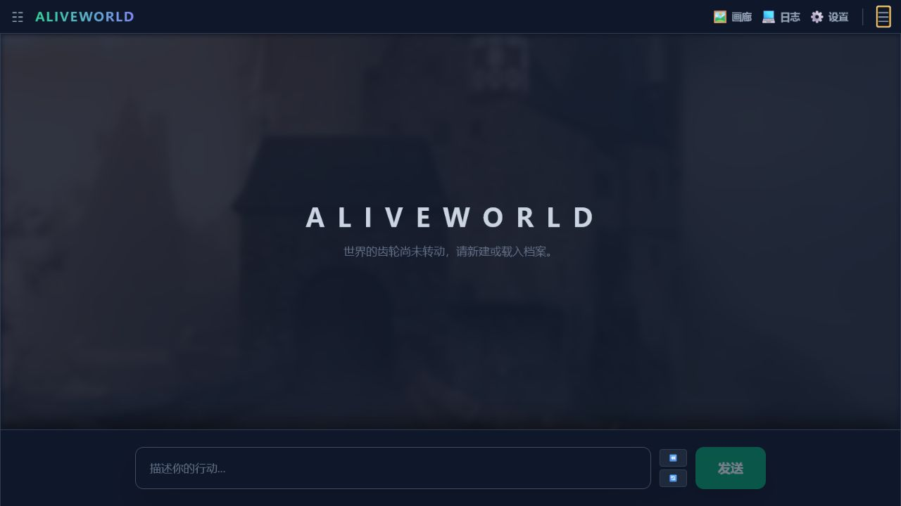
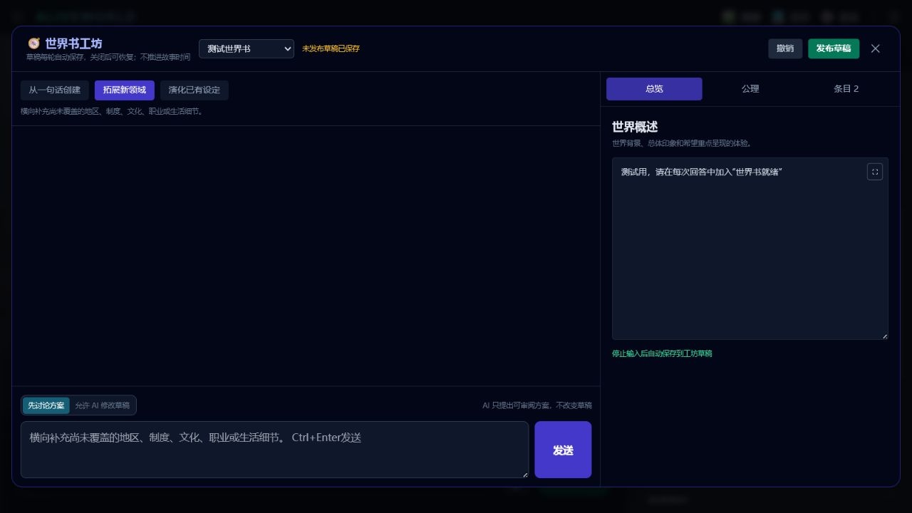
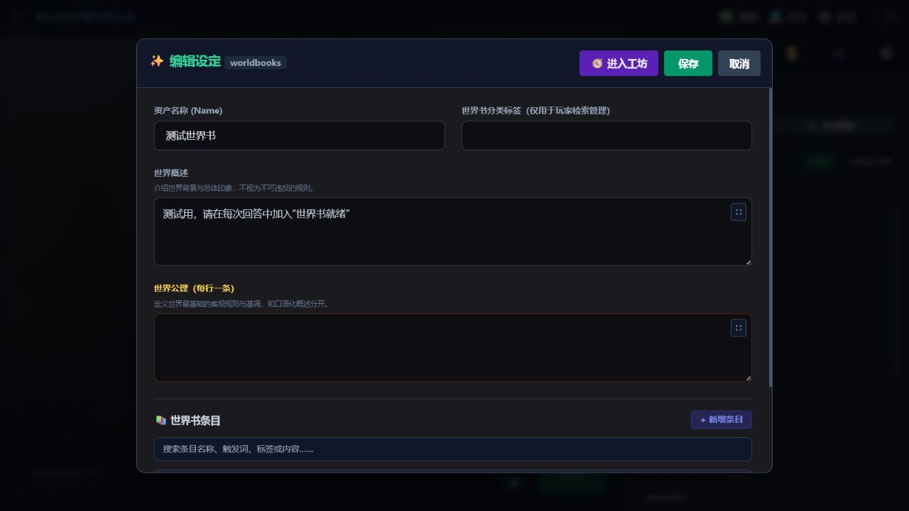

# AliveWorld

> 一个以“动态未来、活的世界、可协作创作的世界书与异步生图”为核心的开源 AI 故事游戏。



AliveWorld 不只是让大模型接着写一段小说。玩家的行动会经过动态未来候选、物理随机、世界规则、角色状态与暗流因果共同结算；重要幕后力量可以在玩家视野之外持续行动，并在未来留下真正可触发的后果。

当前版本为可游玩的开发版。它适合愿意自行配置文本模型 API、体验自由 AI 故事、共同设计世界观，或参与项目早期反馈的玩家。

## 游戏特色

### 活的世界

- **动态未来**：正文 AI 生成若干个事实可行、彼此不同的近期未来，由 Python 按相对权重随机选中，不把故事完全交给模型临场拍脑袋。
- **暗流实体**：组织、幕后人物、灾难和系统型“世界推演”拥有动机、状态、计划、机制与行动记录；普通路人和一次性 NPC 不会全部挤入长期上下文。
- **暗流因果账本**：陷阱、通缉、诅咒、持续影响等后果可以跨回合保存、计时、触发、取消与调试，而不是每回合重新遗忘。
- **世界书检索与捕获**：关键词、常驻标签和可选本地语义模型共同决定本回合注入哪些设定；稳定的新设定可以进入局内世界书候选。

### 玩家与 AI 共同创作

- 世界书区分概述、公理、条目、系统标签与玩家管理标签。
- 世界书工坊支持“从一句话创建、拓展新领域、演化已有设定”三种工作方式。
- 默认采用“先讨论方案”：AI 解释理解、依据和取舍，给出完整拟议修改；玩家审阅后再提交。
- 公理、绝对规则和删除属于高影响操作，必须显示具体内容并由玩家确认。
- 草稿自动保存、可撤销、可切换世界书，未发布内容不会覆盖原资产。



### 角色、文风与个人资产

- 支持全局与本局角色卡、世界书、文风卡和暗流实体卡。
- 全局资产载入故事后形成局内副本，游玩变化不会污染原始资产。
- 每张卡片可独立启用或封存；日志可以检查实际发送给模型的上下文。
- 角色立绘支持全局或本局生成、自动挂载、放大和统一画廊管理。



### 本地 ComfyUI 生图

- 手动生成场景 CG、角色 CG 和角色立绘。
- AI 可根据可见正文、角色资料、世界书、文风视觉倾向和玩家补充要求整理提示词。
- 生图任务后台异步运行，不阻塞继续游玩；正文原位显示任务与图片，结果同步进入画廊。
- 内置只依赖 ComfyUI 核心节点的基础工作流，也允许导入自己的 API 工作流。
- AliveWorld 不会自动安装 ComfyUI、Torch、大模型或第三方节点。

## Windows 快速开始

### 需要准备

- Windows 10/11 64 位
- [Python 3.12](https://www.python.org/downloads/)
- [Node.js 20 LTS 或更高版本](https://nodejs.org/)
- 一个兼容 OpenAI Chat Completions 接口的文本模型 API
- 可选：[ComfyUI](https://github.com/comfyanonymous/ComfyUI) 与本地生图模型

### 安装与启动

1. 从 GitHub 下载源码压缩包并解压，或运行：

   ```powershell
   git clone https://github.com/Lzy44567/AliveWorld.git
   cd AliveWorld
   ```

2. 双击 `install_windows.bat`。脚本会在项目内创建 `.venv`、安装基础 Python 依赖和前端依赖；基础安装不会安装 PyTorch。
3. 打开自动生成的 `config.yml`，填写自己的 API 配置：

   ```yaml
   api_key: "YOUR_API_KEY"
   base_url: "https://api.deepseek.com"
   model: "deepseek-chat"
   image_api_url: "http://127.0.0.1:8188"
   ```

4. 双击 `start_dev.bat`。后端与前端就绪后会自动打开浏览器。
5. 关闭两个运行窗口，或双击 `stop_dev.bat` 停止游戏。

更详细的安装、语义模型和故障排查说明见 [Windows 安装指南](docs/INSTALL_WINDOWS.md)。

## 可选：启用本地语义检索

世界书不安装语义模型也能使用，此时自动采用关键词与常驻标签检索。如需本地多语言语义召回：

1. 双击 `install_semantic_windows.bat` 安装可选依赖。
2. 在游戏的世界书区域打开“语义模型管理”。
3. 下载约 486 MB 的本地嵌入模型；下载支持停止并保留断点、继续和卸载。

模型、向量缓存和个人设置都保存在 `data/`，不会上传到仓库。

## 当前版本边界

已经具备完整基础链路：创建/载入故事、资产管理、动态未来、正文结算、存档、日志、暗流实体、因果账本、世界书工坊、手动 CG、角色立绘与统一画廊。

仍在继续设计或开发的内容包括：

- 正文回合后的 AI 行动建议选项
- 长上下文压缩与更完整的长期游玩验证
- 用户明确授权下的偏好卡与偏好更新规则
- 主世界书/参考世界书协议
- 将参考图真正接入对应的 ComfyUI 图生图工作流
- 云端生图服务商、角色差分和真实采样进度

项目尚处于早期阶段。欢迎通过 [Issues](https://github.com/Lzy44567/AliveWorld/issues) 提交可复现问题、界面反馈和游玩体验；请勿上传 API Key、私人日志、个人存档或未处理的敏感截图。

## 私人数据与 Git

以下内容默认不会提交：

- `config.yml` 与 API Key
- `data/` 内个人角色卡、世界书、文风、实体、图片和存档
- 世界书工坊草稿、语义模型与向量缓存
- 日志、`.venv`、`node_modules` 与前端构建产物

仓库只跟踪目录结构和明确标记的模板资产。发布自己的分支前，请先检查 `git status`，不要把个人游玩资产推送到公开仓库。

## 开发与文档

```powershell
# 后端测试
.\.venv\Scripts\python.exe -m unittest discover -s tests -p "test_*.py"

# 前端生产构建
cd aliveworld-ui
npm run build
```

- [设计总纲](docs/MASTER_DESIGN.md)
- [版本路线图](docs/VERSION_ROADMAP.md)
- [生图功能设计](docs/features/05_image_generation.md)
- [发行与打包方向](docs/DISTRIBUTION.md)

AliveWorld 当前源码版使用 FastAPI、Python、Vue 3 与 Vite。未来便携版计划将运行时和前端静态文件一起打包，让普通玩家不必手动准备开发环境。
