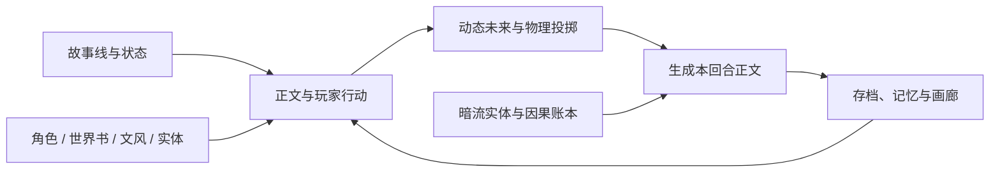
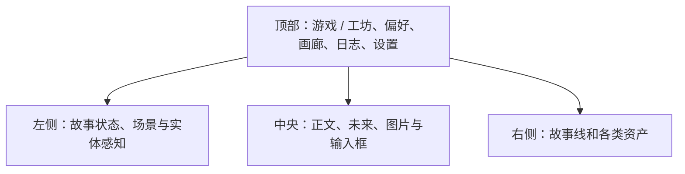

# AliveWorld 玩家指南

> 本指南面向第一次接触 AI 故事游戏的玩家。便携版不要求安装 Python 或 Node.js。

## 一张图看懂 AliveWorld



AliveWorld 会永久保留完整故事原文。记忆压缩只改变发送给模型的工作上下文，不会删除玩家看到的历史正文。

## 五分钟开始

### 1. 解压并启动

1. 把 ZIP **完整解压**到一个可写目录，推荐放在非系统盘。
2. 保持 `AliveWorld.exe` 和 `_internal/` 在一起，不要只复制 EXE。
3. 双击 `AliveWorld.exe`。启动页会先出现，再加载游戏核心。

首次运行会在程序旁建立：

```text
AliveWorld/
├─ AliveWorld.exe
├─ _internal/
└─ UserData/        ← 你的配置、故事、资产、图片和日志
```

### 2. 配置文本模型

1. 点击右上角“设置”。
2. 打开“API 配置”。
3. 填写同一家服务商提供的 Base URL、API Key 和模型名。
4. 点击“保存并测试连接”。
5. 看到连接成功后关闭设置。

API Key 只保存在本机 `UserData/config.yml`。不要把这个文件、完整日志或带密钥的截图发给别人。

### 3. 创建第一条故事线

1. 右侧打开“故事线”。
2. 点击“新建”。
3. 输入故事名称。
4. “宇宙主导向简述”可以只写一两句话，例如：

   > 一座漂浮在云海上的魔法城市，玩家是刚到这里的旅行者。

5. 创建后，在中央输入你想做的行动并发送。

如果开启了“快捷行动按钮”，正文下方会给出 2–4 个可直接点击的下一步行动。

### 4. 验证保存

完成一回合后关闭 AliveWorld，再重新打开并载入同一故事。正文、局内资产和设置应继续存在。

## 主界面区域



- **游戏模式**：游玩正文、发送行动和观察故事状态。
- **工坊模式**：与 AI 讨论并编辑世界书、角色、文风、实体和偏好卡。
- **日志**：检查实际发送给模型的上下文和错误原因。
- **画廊**：统一管理本局或全局生成图片。

## 全局资产与本局专属

在工坊中，“当前故事”只显示并编辑当前载入故事线的资产副本，界面会同时显示故事线名称。切换故事线后，工坊会重载新故事的资产；这些修改不会污染全局资产。

世界书条目检索并非只看玩家刚输入的一句话。关键词和语义检索会共同读取近期故事工作上下文与本回合玩家输入，因此连续场景中的设定仍可命中；带“常驻”标签的条目无须关键词命中，也会始终加入正文上下文。

- **全局资产**是可复用的原始卡片。
- **载入本局**会创建当前故事使用的副本。
- 局内变化不会自动污染全局原卡。
- 卡片关闭后仍保留，但不再参与对应的正文或推演请求。

### 世界书

世界书负责规则、背景和可触发设定：

- 概述：帮助 AI 快速理解世界。
- 公理：世界底层必须遵守的规则。
- 条目：地点、制度、魔法、习俗等具体知识。
- 常驻条目：无论当前场景如何都进入正文上下文，应谨慎使用。

### 角色卡

角色卡负责人物设定。全局角色可生成立绘，载入本局后可以形成当前故事中的人物状态。

### 文风卡

文风卡控制正文的视角、节奏、句式、描写重点和禁忌。关闭后不再拼接相应文风要求。

### 暗流实体

暗流实体只用于能够长期行动并持续影响世界的对象，例如组织、幕后人物、灾难或“世界推演”。普通路人不需要全部进入实体库。

## 工坊协作

1. 顶部切换到“工坊”。
2. 右侧选择资产类型和具体卡片。
3. 默认保持“先讨论方案”，让 AI 分析问题、依据和取舍。
4. 审阅提案后再允许 AI 修改草稿。
5. 在左侧直接检查和微调草稿。
6. 发布前，高风险操作会要求逐项确认。
7. 点击发布后才会写入正式资产。

关闭工坊或切回游戏不会丢失未发布草稿，也不会让草稿提前污染正式资产。

## 暗流因果账本

账本记录尚未在正文中公开、但可能在未来影响玩家的因果，例如陷阱、通缉、诅咒和持续机制。

- 条目可以持续或一次性触发。
- 可以记录存在回合、触发次数和来源实体。
- 取消后可恢复，也可以删除。
- 撤回故事回合时，账本状态会随故事一起回滚。

该界面默认更偏向调试，不要求普通玩家频繁手工维护。

## 记忆压缩

- 完整正文永久保留在存档中。
- 达到上下文水位后，只总结较早的一段历史。
- 最近完整回合、未解决线索和重要记忆继续发送给正文模型。
- 压缩失败时会回退到旧的有效记忆，不应阻止正文继续游玩。

记忆模型配置可以留空，此时复用正文模型。

## 用户偏好卡

偏好系统记录行为证据，再用低频分析提出多个可能解释；Python 根据证据强度计算后验，避免模型一句话把猜测当事实。

- 偏好用于倾向性引导，不要求每回合机械重复同类内容。
- 敏感内容分析可以独立关闭。
- 可以按剧情发展、角色互动、动作、视觉和敏感内容等分类关闭消费。
- 输入 `/偏好 你的说明` 可以明确告诉系统一个高先验方向，但后续仍可修正。

## ComfyUI 生图

1. 在设置中填写 ComfyUI 地址，默认通常是 `http://127.0.0.1:8188`。
2. 点击检查连接，读取可用模型。
3. 在正文回合下点击生图，或在角色卡中生成立绘。
4. “AI 整理并开始生成”会把自然语言和当前可见内容整理为生图提示词。
5. 任务异步执行，完成后进入正文和画廊。

基础版只保证纯文生图。上传参考图可以保存和关联，但是否真正进入工作流取决于所选工作流是否包含对应图生图节点。

## 更新、备份与迁移

### 覆盖更新

1. 关闭 AliveWorld。
2. 建议先复制一份旧 `UserData/` 作为备份。
3. 把新版 ZIP 解压到旧版所在位置，允许覆盖 `AliveWorld/` 中的同名程序文件。
4. 不要删除原来的 `UserData/`。
5. 启动新版并载入一个故事检查。

公开 ZIP 不包含 `UserData/`，正常覆盖更新不会删除个人内容。

### 换到全新目录

如果把新版解压到了另一个位置，可在“设置 → 数据与迁移”选择旧版的 `UserData/`。同步采用复制，不删除旧数据，也不静默覆盖同名冲突。

### 手工备份

关闭 AliveWorld 后，复制整个 `UserData/` 即可完成完整备份。

## 常见问题

### 模型连接失败

在“设置 → API 配置”点击“保存并测试连接”，根据提示检查：

- Base URL、API Key、模型名是否属于同一家服务商。
- 模型是否真实存在并允许当前账号调用。
- 余额、网络、系统代理/VPN 和 DNS。

### 双击后暂时没有游戏画面

启动器会立即显示加载页，首次启动可能需要更长时间。如果长期停留，查看 `UserData/logs/launcher.log`。

### 换了目录后看不到旧故事

旧内容通常仍在旧目录的 `UserData/`。不要删除旧目录，使用“设置 → 数据与迁移”复制到新版。

### ComfyUI 错误

AliveWorld 只会在玩家主动点击检查或生成时连接 ComfyUI。确认 ComfyUI 已启动、地址正确、工作流所需模型和节点存在。

## 反馈问题

请提供：

1. AliveWorld 版本号。
2. 做了什么。
3. 预期看到什么。
4. 实际看到什么。
5. 不含 API Key 和私人内容的截图。

日志可能包含故事正文、角色卡和世界书。公开发送前请先检查和脱敏。
